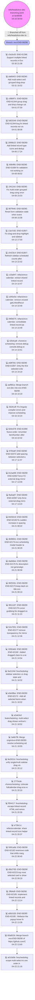

# Branch Life Story: evo-END-58290

```mermaid
graph TD
    Origin(("refs/heads/evo-dev branching point<br/>at 4e48096<br/>04-16 09:59"))
    style Origin fill:#f9f,stroke:#333
    Origin -- "🐣 Branched off from refs/heads/evo-dev to" --> BranchNode{{Branch: evo-END-58290}}
    style BranchNode fill:#bbf,stroke:#333
    C0["💻 c5a3cd3: END-61286: Support multiple linked records in Evo <br/>03-30 21:08"]
    BranchNode --> C0
    C1["💻 dafb943: END-58290: Add multi-select and grouped drag-drop <br/>03-31 16:02"]
    C0 --> C1
    C2["💻 cd9b87c: END-58290 END-61344 group drag and drop change cal<br/>04-01 07:59"]
    C1 --> C2
    C3["💻 5d02549: END-58290 END-61344 bug fix linked records not vis<br/>04-01 08:08"]
    C2 --> C3
    C4["💻 2906b22: END-58290: Add linked record type icons and dedup <br/>04-06 17:24"]
    C3 --> C4
    C5["💻 6964ffd: END-58290 END-61684 fix validation not working on <br/>04-08 08:02"]
    C4 --> C5
    C6["💻 1f412c6: END-58290: Fix multi-order grouped drag using wron<br/>04-08 15:03"]
    C5 --> C6
    C7["💻 987f946: END-58290: Reset form validation state when event <br/>04-08 15:08"]
    C6 --> C7
    C8["💻 13a7c92: END-61807: Fix drag-and-drop highlight and sidebar<br/>04-13 17:59"]
    C7 --> C8
    C9["💻 c5423c4: END-61807: Refresh sidebar scheduled counts after <br/>04-13 22:02"]
    C8 --> C9
    C10["💻 c16a847: refactorevo-calendar: extract shared linked-record<br/>04-14 10:47"]
    C9 --> C10
    C11["💻 cd45e5d: refactorevo-calendar: remove unused getLinkedRecor<br/>04-14 10:49"]
    C10 --> C11
    C12["💻 090b575: refactorevo-calendar: consolidate linked-record pa<br/>04-14 10:49"]
    C11 --> C12
    C13["💻 62b4ca8: choreevo-scheduling: remove debug console.debug st<br/>04-14 10:51"]
    C12 --> C13
    C14["💻 e68f7b5: END-58290  END-61897: Only the first selected orde<br/>04-14 19:19"]
    C13 --> C14
    C15["💻 aaf981a: Merge branch evo-dev into evo-END-58290<br/>04-16 10:19"]
    C14 --> C15
    C16["💻 3b2b1df: Fix Angular compiler errors and improve scheduling<br/>04-16 10:24"]
    C15 --> C16
    C17["💻 6d3c678: END-61990 fixevo-order: renumber ItemNumber after <br/>04-16 10:32"]
    C16 --> C17
    C18["💻 9784aff: END-58290 END-62072 add spacing between selected a<br/>04-17 11:07"]
    C17 --> C18
    C19["💻 612ad69: END-58290 END-62067 force FC external drag mirror <br/>04-17 13:09"]
    C18 --> C19
    C20["💻 fba5a87: END-58290 END-62067 only force external-drag mirro<br/>04-17 13:23"]
    C19 --> C20
    C21["💻 8425619: END-58290 END-62182 fix sudden increase in spacing<br/>04-21 08:22"]
    C20 --> C21
    C22["💻 3b99831: END-58290 END-62174 evo scheduling modal header la<br/>04-21 08:29"]
    C21 --> C22
    C23["💻 dadddee: END-58290 END-62176 fix description not generatign<br/>04-21 08:58"]
    C22 --> C23
    C24["💻 982532c: END-58290 END-62173 keep dash on title evo<br/>04-21 09:19"]
    C23 --> C24
    C25["💻 9811187: END-58290 END-62179 cursor grabbing for dragged ev<br/>04-21 11:23"]
    C24 --> C25
    C26["💻 52e7001: END-58290 END-62177 remove transparency for mirror<br/>04-21 12:36"]
    C25 --> C26
    C27["💻 3282a6d: END-58290  END-62169 : Added dragged class to a se<br/>04-21 14:54"]
    C26 --> C27
    C28["💻 9a3124d: fixscheduling: sidebar selection vs drag state and<br/>04-21 18:32"]
    C27 --> C28
    C29["💻 e0e08be: END-58290  END-62172 : Add all selected items when<br/>04-21 18:32"]
    C28 --> C29
    C30["💻 a2ab3cd: featscheduling: multi-select drag shows vertical c<br/>04-21 18:52"]
    C29 --> C30
    C31["💻 3a6b7f8: Merge origin/evo-END-58290: resolve scheduling sid<br/>04-21 18:55"]
    C30 --> C31
    C32["💻 9e26314: fixscheduling: unify single/multi sidebar drag vis<br/>04-21 20:12"]
    C31 --> C32
    C33["💻 2773cde: chorescheduling: colocate fullcalendar-drag.scss w<br/>04-21 20:20"]
    C32 --> C33
    C34["💻 ff04417: fixscheduling: escape linked-record HTML and remov<br/>04-21 20:30"]
    C33 --> C34
    C35["💻 e730c1c: refactorcalendar: share linked-record icon helper <br/>04-21 20:37"]
    C34 --> C35
    C36["💻 5081a9d: END-58290 END-62182 reremove code that shifts marg<br/>04-22 08:40"]
    C35 --> C36
    C37["💻 d5b2783: END-58290 END-62223 top most selected card is show<br/>04-22 09:19"]
    C36 --> C37
    C38["💻 2ffd4d9: END-58290  END-62185: Implement linked records and<br/>04-22 13:14"]
    C37 --> C38
    C39["💻 a90c528: END-58290  END-62185 : Refactor the popup hover fo<br/>04-22 13:39"]
    C38 --> C39
    C40["💻 60a852b: Merge branch evo-END-58290 of https://github.com/C<br/>04-22 13:40"]
    C39 --> C40
    C41["💻 a010d0b: fixscheduling: scope multi-select to one order in <br/>04-22 21:16"]
    C40 --> C41
```

