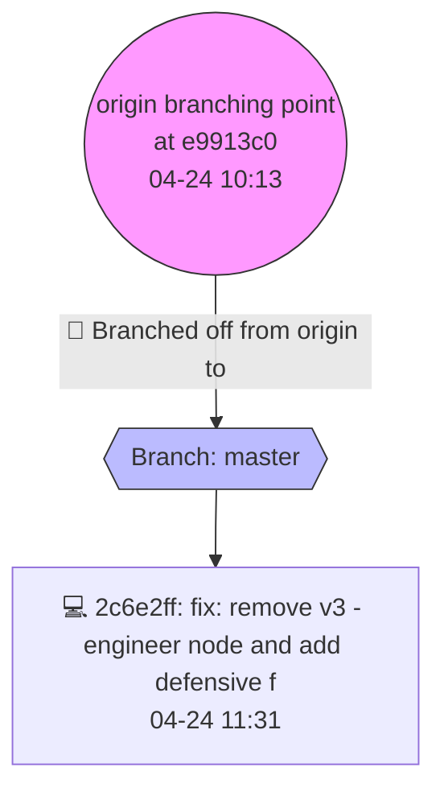

# Branch Life Story: master

```mermaid
graph TD
    Origin(("origin branching point<br/>at e9913c0<br/>04-24 10:13"))
    style Origin fill:#f9f,stroke:#333
    Origin -- "🐣 Branched off from origin to" --> BranchNode{{Branch: master}}
    style BranchNode fill:#bbf,stroke:#333
    C0["💻 2c6e2ff: fix: remove v3 - engineer node and add defensive f<br/>04-24 11:31"]
    BranchNode --> C0
```

