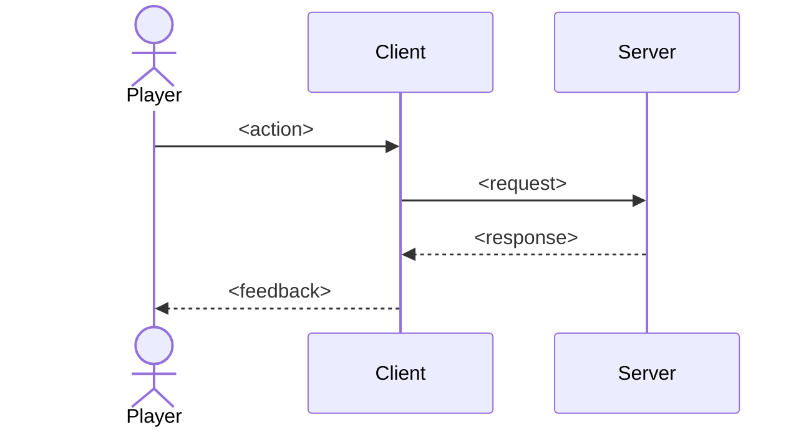
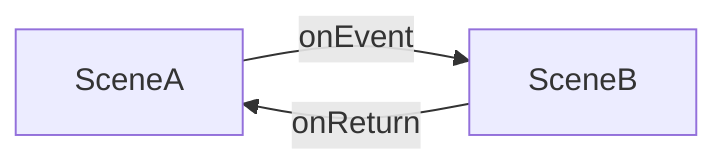
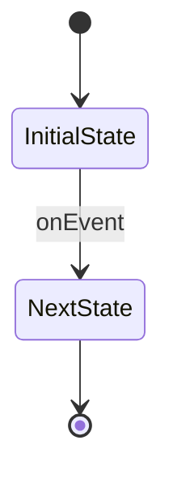

# Diagram Authoring Playbook

Quick-reference for creating Mermaid diagrams that model player ↔ app behavior. Codifies decisions from the diagram exploration session — use this as the source of truth when making new diagrams.

For deeper examples: [`swimlane-patterns.md`](./swimlane-patterns.md), [`scene-state-template.md`](./scene-state-template.md).

---

## 1. Pick the right diagram

| Situation | Diagram type |
|---|---|
| Player taps, app reacts, server validates — order matters | `sequenceDiagram` with `Player`, `Client`, `Server` participants |
| A scene loads data + polls a service + waits for input (concurrent) | **Sibling state diagrams**: parent `flowchart` + N flat `stateDiagram-v2` |
| Single screen / single concern, just transitions | `stateDiagram-v2` |
| Decision branches grouped by actor | `flowchart LR` + `subgraph` lanes (last resort) |

**Default pair:** state diagram (structure) + sequence diagram (runtime behavior). The state diagram tells AI *what to build*; the sequence diagram tells it *what calls what*.

---

## 2. Naming conventions (always)

- **State IDs are code identifiers.** `HomeScene`, `LoadingProfile` — not `"Home Scene"` or `"Loading Profile"`. They become enum values / class names.
- **Event labels are method names.** `onGearsPressed`, `onProfileFetched`, `on60sTick` — not `"tap gears"` or `"60s timer"`. They become event handler signatures.
- **Sibling titles become module names.** `Data Loading` → `DataLoader.ts`, `Input Handling` → `InputController.ts`.
- **Activation arrow label is `activates`** (not `spawns`, `starts`, or `runs`).

---

## 3. The sibling pattern (concurrent state machines)

When a scene needs to do multiple things simultaneously, do NOT use nested parallel regions (`--` separator). Instead:

1. **Parent flowchart** — scene-to-scene transitions only.
2. **N sibling diagrams** — one flat `stateDiagram-v2` per concurrent concern. Max ~6 states each; split if larger.
3. **Concurrency contract in prose** — one sentence above the siblings: *"These run concurrently while X is active."* The diagram cannot enforce this; the doc must.
4. **Terminal `[*]` in a sibling = signal to the parent.** When a sibling reaches `[*]`, the parent flowchart transitions.

Full template: [`scene-state-template.md`](./scene-state-template.md).

---

## 4. Editor portability rules (nexus + Mermaid 11.14)

The custom editor cannot reliably handle:

- `classDef` and `:::class` styling — **omit entirely**.
- Em dashes (`—`) in labels — use plain hyphens or spaces.
- Dotted-arrow-with-label syntax (`-.label.->`) — use `-->|label|` with a normal arrow.
- Cross-subgraph edges may block visual editing — if so, drop the unified view and rely on modular siblings only.

When in doubt: write portable first, add styling later only if the editor accepts it.

---

## 5. Co-location

Diagrams live next to the code they describe:

```
HomeScene/
  HomeScene.ts
  diagrams.md   ← parent flowchart + siblings for this scene
```

Not in a separate `docs/` tree. AI tools read sibling files first; co-location makes context loading automatic.

---

## 6. Minimum viable templates

**Sequence diagram (player ↔ app ↔ server):**



**Parent flowchart (scene transitions):**



**Sibling state machine (one concern):**



---

## 7. Checklist before publishing a diagram

- [ ] State / event names are code-shaped (PascalCase IDs, `on*` events)
- [ ] No `classDef`, no em dashes, no dotted-labeled arrows (editor portability)
- [ ] If concurrent: parent flowchart + flat siblings, with prose concurrency contract
- [ ] Co-located with the code it describes
- [ ] Each sibling has ≤ 6 states (else split)
- [ ] Terminal `[*]` semantics documented (which scene transition it triggers)
