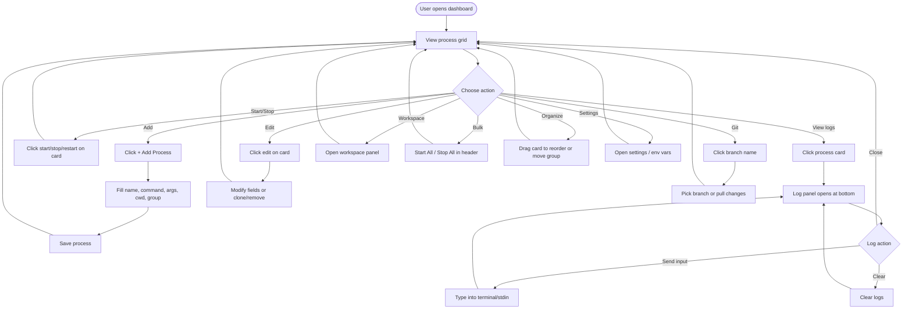

# User Flow

```mermaid
flowchart TD
    Start([User opens dashboard]) --> View[View process grid]
    View --> Action{Choose action}

    Action -->|Add| Add[Click + Add Process]
    Add --> Fill[Fill name, command, args, cwd, group]
    Fill --> Save[Save process]
    Save --> View

    Action -->|Start/Stop| Control[Click start/stop/restart on card]
    Control --> View

    Action -->|View logs| Select[Click process card]
    Select --> Logs[Log panel opens at bottom]
    Logs --> LogAction{Log action}
    LogAction -->|Send input| Stdin[Type into terminal/stdin]
    LogAction -->|Clear| Clear[Clear logs]
    LogAction -->|Close| View
    Stdin --> Logs
    Clear --> Logs

    Action -->|Edit| Edit[Click edit on card]
    Edit --> Modify[Modify fields or clone/remove]
    Modify --> View

    Action -->|Git| Branch[Click branch name]
    Branch --> BranchPick[Pick branch or pull changes]
    BranchPick --> View

    Action -->|Workspace| Workspace[Open workspace panel]
    Workspace --> View

    Action -->|Bulk| Bulk[Start All / Stop All in header]
    Bulk --> View

    Action -->|Organize| Org[Drag card to reorder or move group]
    Org --> View

    Action -->|Settings| Settings[Open settings / env vars]
    Settings --> View
```
